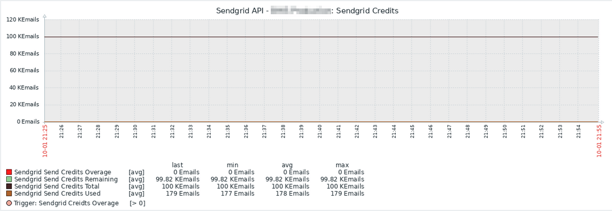
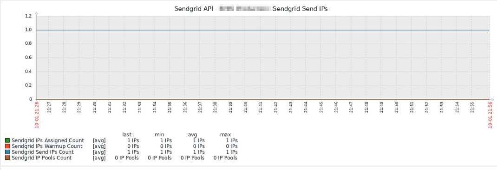
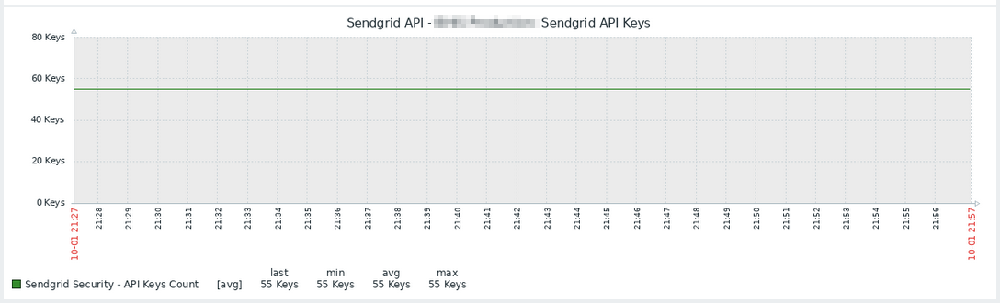
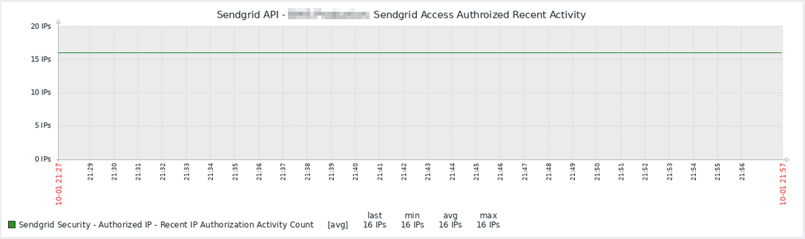
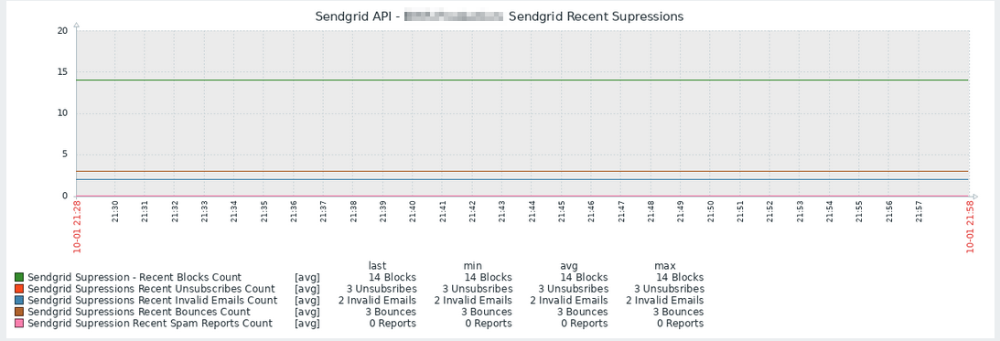
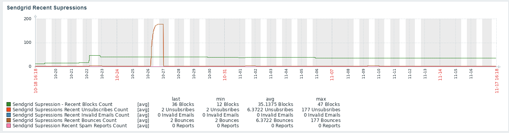
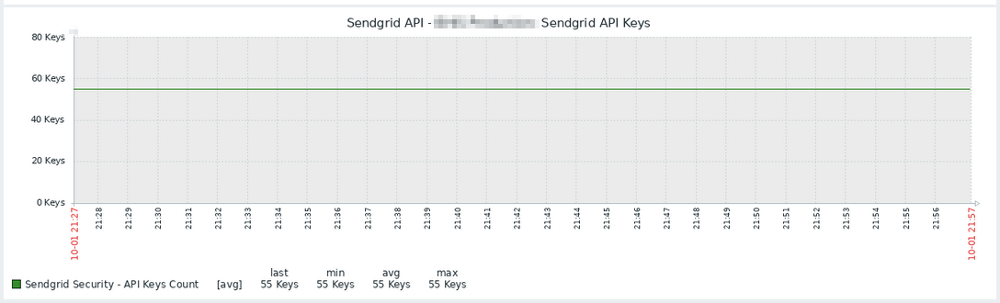
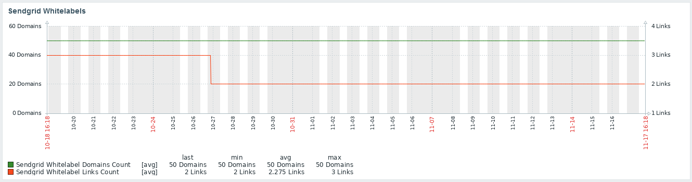

# Zabbix_Sendgrid_Api_Provider
Zabbix Template for Sendgrid Account Metrics

<!-- Start Document Outline -->

* [Background](#background)
* [Installation](#installation)
* [Methodology](#methodology)
* [Features](#features)
* [Details](#details)
* [Triggers](#triggers)
* [Macros](#macros)
* [Tags](#tags)
* [Known Limitations &amp; Issues](#known-limitations--issues)
* [Screenshots](#screenshots)
	* [Credits Graph](#credits-graph)
	* [Send IPs Graph](#send-ips-graph)
	* [API Keys Graph](#api-keys-graph)
	* [Recent Authorized IPs](#recent-authorized-ips)
	* [Recent Supressions](#recent-supressions)
	* [Sendgrid White Labels](#sendgrid-white-labels)
* [Updates](#updates)
* [Contact](#contact)
* [License](#license)
* [Thanks](#thanks)

<!-- End Document Outline -->

## Background 
This template is used to monitor and alert on Sendgrid Account useage via the Sendgrid v3 API
Built in Zabbix 5.4.  May work with other versions.

## Installation
- Import zabbix_sendgrid_api.yaml
- Create new Host
- Assign Template "Sendgrid API Provider" to Host
- Set Macro {$SENDGRIDAPIKEY} to your Sendgrid API Key
- Add an agent host (can be left blank, only necessary to allow HTTP Agent to operate)
## Methodology
- Uses sendgrid v3 API to procure Sendgrid Account Data
- Data is gathred 

## Features
- Credit Monitoring
- Account Security Monitoring
- Configuration Monitoring
- Not-Configured Informational Alerts
- Graphs and Stuff

## Details
- 89 Items
- 24 Triggers
- 11 Graphs
- 1 Dashboard

## Triggers
- Whitelabel Link Changes 
- Whitelabel Domain Changes
- Webhook URL Change
- Verified Senders Changed
- New Suppression - Unsubscriber
- New Suppression - Spam Report
- New Suppression - Invalid Address
- New Suppression - Blocked Email
- New Suppression - Bounced Email
- Subuser Account Change
- Missing Configuration - Sender Verification
- Missing Configuration - Domain Verification
- Missing Configuration - Spam Alert Forward
- Missing Configuration - No IP Authorization
- Missing Configuration - Alerts 
- Credits Overage
- Credits Plan Change
- Credits 50% Used
- Credits 75% Used
- Credits 90% Used
- Authorized IP Access Changed
- Sendgrid API Key Removed
- Sendgrid API Key Added

## Macros
- {$SENDGRIDAPIKEY} (Your Sendgrid API Key)

## Tags
- Application:API
- Application:Sendgrid
- API:Sendgrid
- Sendgrid:Data (JSON API Data Source)
- Sendgrid:IPs (IP Information)
- Sendgrid:Credits (Credit Information)
- Sendgrid:Remaining (Credit Remaining)
- Sendgrid:Overage (Credit overage)
- Sendgrid:Settings (Account Settings)
- Sendgrid:Stats (Stats Endpoint)
- Sendgrid:User (SubUser Endpoint)
- Sendgrid:Supression (Supression Stats)
- Sendgrid:Design (Designs Endpoint)
- Sendgrid:Count (Count of items)
- Sendgrid:Domains (Domain Endpoint)
- Sendgrid:SpamReports

## Known Limitations & Issues
- Subuser account metrics are not gathered. 
- General Stats are not currently gathered.
- Some API queries require "Full Control" even though they do not make a change.  "Credit" queries require "Full Control".  Other API queries will operate with only "Read Only" custom privileges.  

## Screenshots

### Credits Graph

### Send IPs Graph

### API Keys Graph

### Recent Authorized IPs

### Recent Supressions

### Sendgrid White Labels

## Updates
- Nov 17 2021: Updated tags, screenshots, addd export format

## Contact
@Krelkci (twitter)   @ Relkci (Github)

## License
Apache 2

## Thanks
Black Hills Information Security https://www.blackhillsinfosec.com
